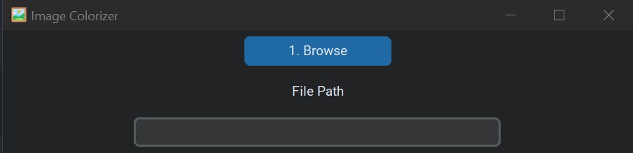
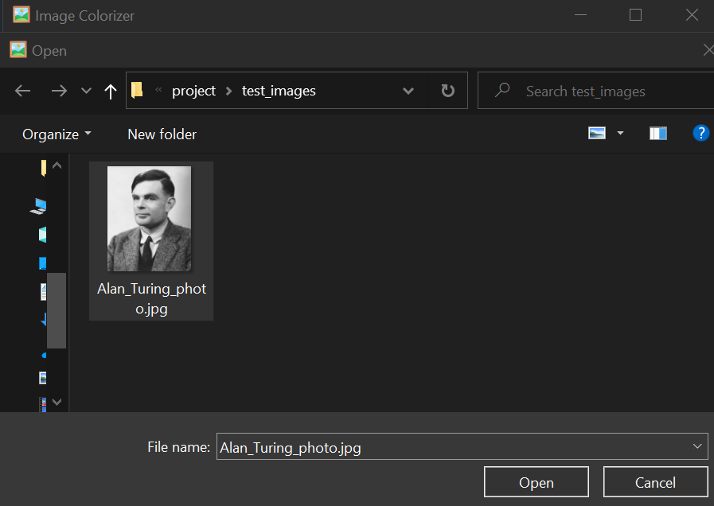
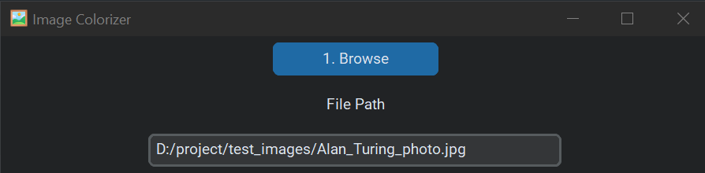
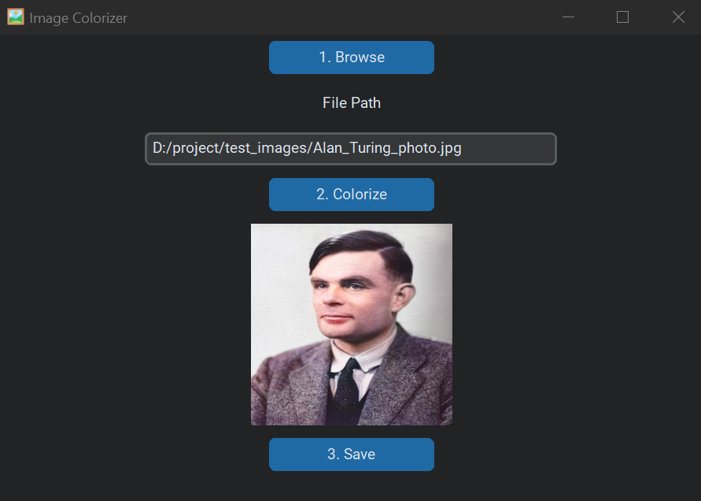
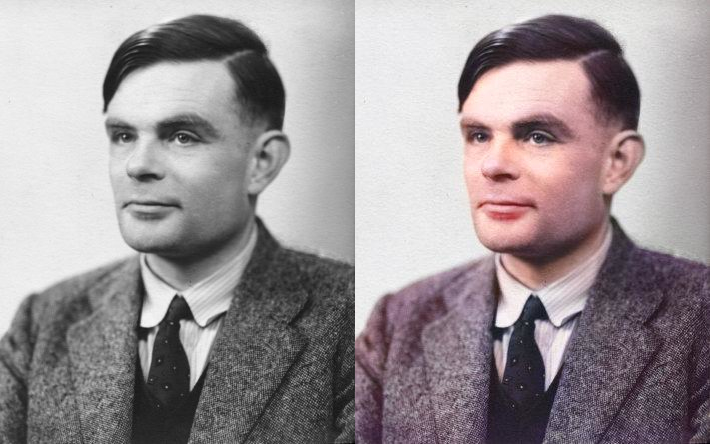
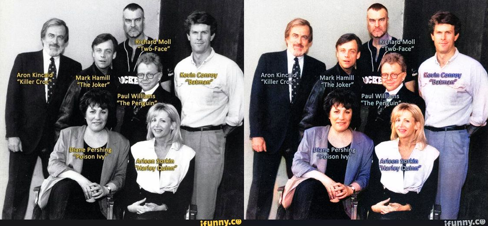
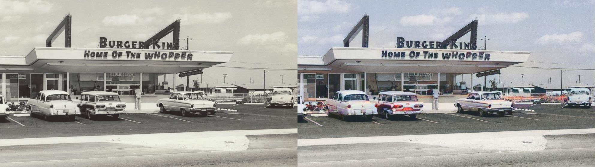

<div id="top"></div>

<!-- PROJECT LOGO -->
<br />
<div align="center">
  <a href="https://github.com/ralphcajipe/image-clorizer">
    
  </a>

<h3 align="center">Image Colorizer: Back to Life</h3>

  <p align="center">
    A CS50P Final Project
    <br />
    <a href="https://youtu.be/AEMa_eepE4U">View Demo</a>
  </p>
</div>

# About Image Colorizer: Back to Life

This is a desktop app that uses DeOldify's deep learning model to colorize
black and
white images. It provides a convenient graphical user interface (GUI) where you
can select
a black and white image, colorize it, and save the result to a file.

## Project Structure

    ├── README.md          <- The text file that provides information about a project, including its purpose, dependencies, and how to use it.
    │
    ├── deoldify          <- DeOldify's Source Code for colorizing and restoring old images.
    │
    ├── fastai            <- Folder containing the fastai library, which is an open-source deep learning library.
    │
    ├── fid               <- Folder containing open-source library for computing the Fréchet Inception Distance.
    │
    ├── models            <- Folder containing the Artistic model to be used for colorizing images.
    │
    ├── result_images     <- Folder to store colored images.
    │
    ├── test_images       <- Folder to store black and white images to be colorized.
    │
    ├── assets            <- Folder containing the project's logo and images used in the README.md file.
    │
    ├── requirements.txt  <- The text file that contains the list of dependencies to be installed.
    │
    ├── project.py        <- The main Python file that contains the code for the project's GUI.
    │
    ├── test_project.py   <- The Python file that contains the automated testing for the project's GUI.
    │                        Use the built-in testing tool in PyCharm. 
    │                        To do this, open the test file in PyCharm and navigate to the line of code that you want to test. 
    │                        Then, right-click on the line of code and select "Run '<test_name>'" from the context menu.
    │                        Or simply use pytest by running the command 'pytest test_project.py' in the terminal.

---

## Getting Started

To use this project, you will need to have Python 3.9.0 installed on your
computer.
You can download
Python [here](https://www.python.org/downloads/release/python-390/).

In addition, your computer will need to be supported with CUDA in order to run
the app. <br>
You can check if your GPU supports
CUDA [on this page](https://developer.nvidia.com/cuda-gpus) on the NVIDIA
website.

Once you have Python and CUDA installed, you will need to install the required
libraries. You can do this by running the following command in a terminal:

```
pip install -r requirements.txt
```

Download pretrained DeOldify model. On your terminal run the following
command: <br>

```mkdir models``` <br>
```wget https://data.deepai.org/deoldify/ColorizeArtistic_gen.pth -O ./models/ColorizeArtistic_gen.pth```
> **Note:**
> The [model](https://data.deepai.org/deoldify/ColorizeArtistic_gen.pth) is too
> large to be uploaded to GitHub. This is why you
> need to download it separately and place it in the "models" folder.

Then, you can run the project by using the following command:

````
python project.py
````

This will open the GUI where you can select a black and white image, colorize
it, and save the result to a file.

## How to Use the GUI

1. Click the "Browse" button to open a file dialog box.
    <br><br>

2. Select a black and white image from your computer.
    <br><br>
    <br><br>

3. Click the "Colorize" button to colorize the image.
4. The colorized image will be displayed in the GUI.
    <br><br>
5. Click the "Save" button to save the colorized image to a file.

That's it! You can now colorize black and white images to bring it back to life
with the help of this project. <br>

## Example Images

Alan Turing <br>
_Father of Modern Computer Science_<br>
 <br><br>

The Voices of Batman: The Animated Series <br>
 <br><br>

Old Burger King <br>
 <br><br>

## More Information

The project uses the DeOldify library's ```get_image_colorizer()``` function to
create an image colorizer with the artistic=True argument. This tells the
colorizer to use an artistic style when colorizing the image. The colorizer is
then used to colorize the image in the ```colorize_image()``` function using
the
```plot_transformed_image()``` method. The resulting image is displayed in the
GUI
using the Tkinter Image and ImageTk classes. The user can also save the
colorized image using the ```Image.save()``` method.

<!-- CONTACT -->

## Contact

Ralph Cajipe - [@ralphcode](https://twitter.com/ralphcode) -
ralphcajipe@gmail.com

Project
Link: [https://github.com/ralphcajipe/image-colorizer](https://github.com/ralphcajipe/image-colorizer)

<p align="right">(<a href="#top">back to top</a>)</p>

<!-- ACKNOWLEDGMENTS -->

## Acknowledgments

* [DeOldify](https://github.com/jantic/DeOldify)
* [CustomTkinter](https://github.com/TomSchimansky/CustomTkinter)
* [Harvard's CS50P](https://cs50.harvard.edu/python)

<p align="right">(<a href="#top">back to top</a>)</p>
